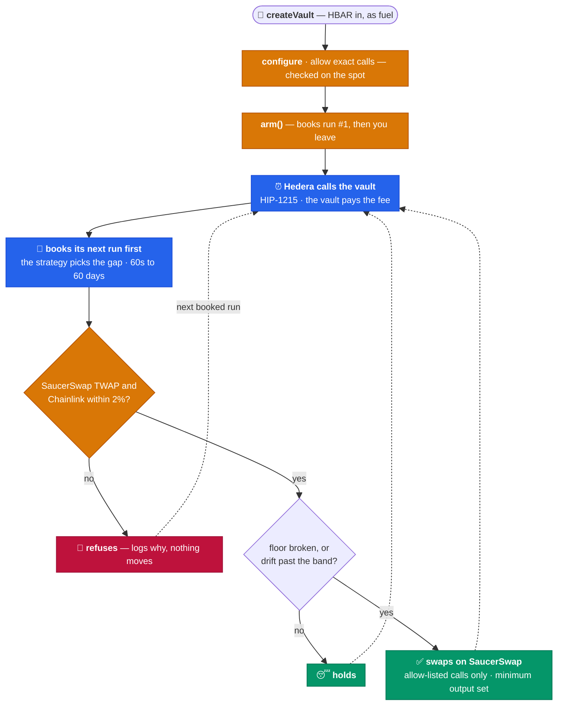
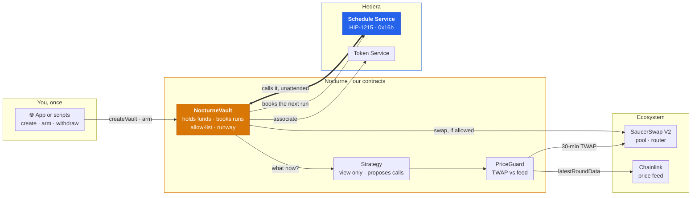

<div align="center">

# 🌙 Nocturne

### Cron for contracts, on Hedera. No server.

**A contract can't wake itself up, so every on-chain job ends up needing a server.** Nocturne is a Scaffold-HBAR template without one. A vault books its own next run through the **Hedera Schedule Service** (HIP-1215), pays for it from its own balance, and chooses how soon to look again. When a job moves money, it won't trade unless **SaucerSwap** and **Chainlink** agree on the price.

[](https://github.com/Madhav-Gupta-28/Nocturne/actions/workflows/lint.yaml)
[](https://github.com/Madhav-Gupta-28/Nocturne/actions/workflows/scaffold-gate.yaml)


🌐 **[Live app](https://hedera-nocturne.vercel.app)** · 📚 **[Docs](https://hedera-nocturne.vercel.app/docs/quickstart)** · 🟢 **[Guard on duty](https://hashscan.io/testnet/account/0.0.10710268)** · 📄 **[Architecture](ARCHITECTURE.md)**

</div>

```bash
npm create scaffold-hbar@latest -- nocturne --template Madhav-Gupta-28/Nocturne
```

---

## The problem

A contract only runs when somebody calls it. A stop-loss, a rebalance or a payroll needs somebody to show up on time.

Other chains rent that somebody from a keeper network. Chainlink Automation [doesn't run on Hedera](https://docs.chain.link/chainlink-automation/overview/supported-networks), so teams run their own bot: a server, a cron job and a hot key that must all be up at 3am. When the bot stops, the job stops, and nothing on chain says so.

Hedera has the fix built in. The **Schedule Service** lets a contract book its own future call. But it is raw, and we measured [six ways](docs/hedera-landmines.md) it stops for good while every transaction still says `SUCCESS`.

A job that trades adds one more risk: acting on a bad price. In July 2026 one manipulated oracle price took [$9.05M out of Bonzo Lend](https://www.coindesk.com/web3/2026/07/11/lending-protocol-bonzo-loses-77-of-value-locked-as-usd9-million-oracle-exploit-rattles-hedera).

## What Nocturne is

A template for **contracts that run themselves**. You write a strategy, one file with four functions. Nocturne supplies the rest:

- **The engine.** `NocturneVault` books its next run *before* doing any work, so a failing strategy costs one run, never the chain.
- **The fuel.** The vault pays for every run itself, and `runway()` counts runs left the way the network counts them.
- **The pace.** The strategy picks each gap: six hours when nothing is close, sixty seconds when something is.
- **The guard.** No trade unless a 30-minute SaucerSwap V2 TWAP and a Chainlink feed agree within 2%. Otherwise the vault refuses and logs why.

Three strategies ship on the same engine: a **heartbeat**, a **protective exit** (sell below a floor) and a **drift rebalancer** (hold a ratio).

> 🔓 **Try it**: [hedera-nocturne.vercel.app](https://hedera-nocturne.vercel.app). Create a vault, arm it and close the tab. Come back later and it will have run, with no transaction from you.

## How it works

One vault, from creation to a loop the network runs by itself. **Amber is our code, blue is Hedera acting on its own**, green is an outcome and red is a refusal.



- **Book first, then think.** The next run is booked before the strategy is asked anything, and `executeScheduled` never reverts.
- **The strategy sets the pace.** Six hours far from the floor, sixty seconds within 1% of it. Hedera's own `ScheduledVault` example can only take a fixed interval.
- **Refusing is a result.** A bad reading becomes a reason (`sources disagree`, `feed stale`) in a `Refused` event, not a revert.
- **The vault pays.** Each run is charged to its own balance. `runway()` counts the reserve the network checks, which is twice the fee.

## The trust ladder

Automation normally asks you to trust six things. Each rung removes one.

| You'd normally trust | Nocturne | Hedera primitive |
| --- | --- | --- |
| 🖥️ **A keeper server** | The network calls the vault at the second it booked | **Schedule Service** (HIP-1215) |
| 🔑 **The keeper's hot key** | None exists. A scheduled call arrives as the vault calling itself | `msg.sender == address(this)` |
| 🔮 **One price feed** | A DEX TWAP and an oracle must agree, or nothing trades | **SaucerSwap V2** + **Chainlink** |
| 🧩 **The strategy's code** | It only proposes. The vault runs calls you allowed by exact `(target, selector)` | `_callsAllowed` |
| ⛽ **Your fuel maths** | `runway()` counts the 3M-gas reserve, not the ~1.5M charged | `tx.gasprice`, in tinybar |
| 🚪 **Being able to leave** | Withdraw any time, armed or not. `disarm` can't be blocked | no lock |

## Hedera, used end-to-end

Take any row away and a shipped strategy stops working.

| Capability | What Nocturne does with it | Live |
| --- | --- | --- |
| **Schedule Service** | `scheduleCall` books each next run from inside the contract. `hasScheduleCapacity` is checked first, and `deleteSchedule` releases a run on disarm | [guard's runs](https://hashscan.io/testnet/account/0.0.10710268) |
| **SaucerSwap V2** pool | A 30-minute TWAP from `observe`, through our own [`TwapLib`](packages/hardhat/contracts/lib/TwapLib.sol) + [`TickMath`](packages/hardhat/contracts/lib/TickMath.sol) | [USDC/DAI pool](https://hashscan.io/testnet/contract/0xb431866114b634f611774ec0d094bf11cb91c7e4) |
| **SaucerSwap V2** router | The trade: `exactInputSingle`, minimum output set from the more cautious price | [the sale](https://hashscan.io/testnet/transaction/1790319308.034520104) |
| **Chainlink** | The second opinion. Staleness checked per feed, decimals normalised | [DAI/USD](https://hashscan.io/testnet/contract/0xdA2aBF7C90aDC73CDF5cA8d720B87bD5F5863389) |
| **Token Service** | The vault associates itself with every HTS token before holding it | [`associate`](packages/hardhat/contracts/NocturneVault.sol) |
| **Mirror Node** | The proof: a scheduled transaction's transfer list shows the vault paid | [below](#proven-on-hedera) |

We built on one service and went deep instead of touching five. The [six silent failure modes](docs/hedera-landmines.md) we measured are each guarded in the vault and reproducible from the docs.

## Proven on Hedera

Read back off **testnet** on 27 September 2026 across ten vaults. [See the guard on duty](https://hashscan.io/testnet/account/0.0.10710268).

| | |
| --- | --- |
| Runs executed by the network, unattended | **32** |
| HBAR those runs cost, paid by the vaults | **57.94** |
| ↳ executed a plan | **19**: 15 heartbeats, 3 sales, 1 rebalance |
| ↳ refused, sources disagreed | **5** |
| ↳ held, or nothing left to protect | **8** |
| Runs any owner sent | **0** |

```bash
# count them yourself: no key, no account
for a in 0.0.10684549 0.0.10690925 0.0.10691327 0.0.10691817 0.0.10710164 \
         0.0.10710193 0.0.10710268 0.0.10715956 0.0.10716071 0.0.10716165; do
  curl -s "https://testnet.mirrornode.hedera.com/api/v1/transactions?account.id=$a&limit=100" \
    | jq '[.transactions[] | select(.scheduled and .result == "SUCCESS")] | length'
done | paste -sd+ - | bc      # 32, and growing while the guard runs
```

Same code, same 2% tolerance, three markets:

| Vault | SaucerSwap | Chainlink | What happened | Paid by vault |
| --- | --- | --- | --- | --- |
| [WHBAR](https://hashscan.io/testnet/transaction/1790319391.014683746) | $2.0382 | $0.0920 | **Refused.** 22x apart. Kept all 0.1 WHBAR. | 1.81 HBAR |
| [DAI](https://hashscan.io/testnet/transaction/1790319308.034520104) | $1.0023 | $0.9999 | **Sold.** 0.24% apart. 1 DAI → 1.001757 USDC. | 2.64 HBAR |
| [DAI/USDC](https://hashscan.io/testnet/transaction/1790351600.061675104) | $1.0023 | $0.9999 | **Rebalanced.** 100% DAI vs a 50% target. 0.5 DAI → 0.500878 USDC. | 2.66 HBAR |

**The refusal is the point.** The testnet WHBAR pool sits ~20x above the real HBAR price, because nobody arbitrages testnet. From inside a contract that looks exactly like a manipulated price. The vault's floor was broken, and it still refused to sell into a price it couldn't confirm.

**Who paid?** Read the transfer list, not the transaction id. The id names whoever created the schedule. The transfer list shows the vault paid, and nobody else:

```bash
curl -s "https://testnet.mirrornode.hedera.com/api/v1/transactions?timestamp=1790319308.034520104" \
  | jq '.transactions[] | {scheduled, result, paid_by: [.transfers[] | select(.amount < 0)]}'
# { "scheduled": true, "result": "SUCCESS", "paid_by": [{ "account": "0.0.10710193", ... }] }
```

After the sale, the DAI vault found nothing left to protect and booked its next check **60 days** out instead of burning fuel every minute.

### Live contracts

All Sourcify-verified.

| | Address | Hedera id |
| --- | --- | --- |
| **NocturneFactory** | [`0xc0f202Ac…4B78`](https://hashscan.io/testnet/contract/0xc0f202Ac01475AFBD07e09643d56bdacC9294B78) | `0.0.10691786` |
| **ProtectiveExitStrategy** | [`0x942bBa07…dBfd`](https://hashscan.io/testnet/contract/0x942bBa07CfC2FAf1dD000C73FF04ccAabC61dBfd) | `0.0.10710158` |
| **DriftRebalanceStrategy** | [`0xfFFc7Da4…5D64`](https://hashscan.io/testnet/contract/0xfFFc7Da411a899e8c76fc4546D63e8e38Fc55D64) | `0.0.10691785` |
| **HeartbeatStrategy** | [`0xA5638e66…2428`](https://hashscan.io/testnet/contract/0xA5638e6682e2FDCC89CEE92Ffc9EC98F3D602428) | `0.0.10685481` |
| **PriceLens** | [`0x7F017Bd0…cCdb`](https://hashscan.io/testnet/contract/0x7F017Bd04879389b2A9CEeD5941EeE75aD28cCdb) | `0.0.10691788` |
| **Heartbeat** | [`0x8b63C92F…ec0b`](https://hashscan.io/testnet/contract/0x8b63C92F7d906862922D060C7Ffc294d8a43ec0b) | `0.0.10684532` |
| **Guard on duty** | [`0xaFa895f7…837f`](https://hashscan.io/testnet/account/0.0.10710268) | `0.0.10710268` |

## Architecture



The vault is the only contract that holds your funds or makes calls for you. A strategy is a view-only advisor: it reads and proposes, and the vault checks every call against your allow-list first.

## Write a strategy

The engine, the fuel accounting and the price guard are done. A new job is one file:

```solidity
interface INocturneStrategy {
    function plan(bytes calldata config) external view returns (Action[] memory);       // what to do; empty = refuse
    function nextInterval(bytes calldata config) external view returns (uint256);       // when to look again
    function validateConfig(bytes calldata config) external view returns (bool);        // checked at configure
    function explain(bytes calldata config) external view returns (string memory, uint256, uint256); // why
}
```

The worked example, [`TopUpStrategy`](packages/hardhat/contracts/examples/TopUpStrategy.sol), is under 80 lines with its own tests. The guide is at [/docs/writing-a-strategy](https://hedera-nocturne.vercel.app/docs/writing-a-strategy). DCA, loan protection, vesting and LP compounding all fit the same four functions.

## Tech stack

- **Contracts**: Solidity 0.8.28 · Hardhat · OpenZeppelin · `NocturneVault` · `NocturneFactory` · three strategies · `PriceGuard` / `TwapLib` / `TickMath` · `PriceLens`
- **Hedera**: Schedule Service (HIP-1215) · Token Service · Mirror Node REST · Hashio JSON-RPC · Sourcify
- **Ecosystem**: SaucerSwap V2 (pool TWAP + SwapRouter) · Chainlink price feeds
- **Front end**: Scaffold-HBAR · Next.js App Router · wagmi · RainbowKit · docs served in-app
- **Quality**: 168 offline tests + 5 live · 100% line coverage · zero lint warnings · CI + scaffold gate · [Hedera Harness recipe](.harness/README.md)

## Testing

| Suite | Tests | Covers |
| --- | --- | --- |
| Engine | **67** | Vault, factory, scheduler: arming, chain survival, early callers, allow-list, fuel, withdrawals, and a Schedule Service that is [missing, reverts or answers short](packages/hardhat/test/NocturneVault.edges.test.ts) |
| Strategies | **75** | Exit, rebalance, heartbeat, docs example: decisions, cadence, every config rejection, end to end |
| Price guard | **26** | Tick maths vs the live pool, TWAP rounding, stale / missing / malformed feeds, `PriceLens` |
| [Live](packages/hardhat/test/live/PriceGuardLive.test.ts) | **5** | The deployed guard against the real pool and feed. Read-only, no key |

Coverage on every shipped contract: **100% of lines and functions, 98.8% of statements, 94.3% of branches** (`npm run hardhat:coverage`).

There is no Schedule Service on a local chain, so [`MockHederaScheduleService`](packages/hardhat/contracts/test/MockHederaScheduleService.sol) is installed at `0x16b` and follows the real one's rules: response codes instead of reverts, one booking per transaction, nothing past 62 days. CI runs on Node 20 and 22, and a [scaffold gate](.github/workflows/scaffold-gate.yaml) creates a fresh project from this repo with the published CLI, then tests, builds and boots it, on every push and daily.

## Security notes

- **`executeScheduled` never reverts.** A revert would take the next booking with it. Early or unarmed calls return. A failing `plan` is caught.
- **Consent is per `(target, selector)`.** Allowing `approve` on a token doesn't allow `transfer`. One call off the list rejects the whole plan before anything runs.
- **A plan can't move HBAR.** Any action with `value`, or without a selector, is refused.
- **New strategy, no old grants.** `setStrategy` retires every permission given to the previous one.
- **Strategies can't write state.** `plan` is called as a view, and [a test](packages/hardhat/test/NocturneVault.test.ts) tries to break that.
- **No early runs by outsiders.** Calls more than 10s before the booked time are ignored.
- **The owner can always leave.** Withdrawals ignore state, and `disarm` succeeds even if the network refuses the delete.
- **Known limit, pinned by a test:** if the swap reverts, the approve before it has landed. It can only point at the configured router, and the next run overwrites it.

## Quick start

**Prerequisites:** Node 20.18.3+, npm, and a testnet account with ~40 HBAR from the [faucet](https://portal.hedera.com/faucet).

```bash
npm create scaffold-hbar@latest -- nocturne --template Madhav-Gupta-28/Nocturne
cd nocturne
```

The `--` is required, or `--template` goes to npm, not the CLI. If GitHub rate-limits the CLI it silently falls back to Foundry, so pin the stack with `-f nextjs-app -s hardhat --package-manager npm`.

**Environment.** Everything has a testnet default. The only value you create is the deployer key, and a script writes it.

| Variable | File | What it is |
| --- | --- | --- |
| `DEPLOYER_PRIVATE_KEY_ENCRYPTED` | `packages/hardhat/.env` | Written by `npm run hardhat:account:generate`. Encrypted. |
| `HEDERA_RPC_URL` | `packages/hardhat/.env` | Optional. Default Hashio testnet. |
| `NEXT_PUBLIC_HEDERA_TESTNET_RPC_URL` | `packages/nextjs/.env.local` | Optional. Default Hashio testnet. |
| `NEXT_PUBLIC_HEDERA_MAINNET_RPC_URL` | `packages/nextjs/.env.local` | Optional. Default Hashio mainnet. |
| `NEXT_PUBLIC_WALLET_CONNECT_PROJECT_ID` | `packages/nextjs/.env.local` | Optional. A shared dev id ships. |
| `HEDERA_MIRROR_TESTNET_URL` | `packages/nextjs/.env.local` | Optional. Default public mirror. |

**Run it.**

```bash
npm run hardhat:test                                   # 168 tests, no network
npm run hardhat:test:live                              # the live guard, read-only
npm run hardhat:account:generate                       # then fund it at the faucet
npm run hardhat:deploy -- --network hederaTestnet      # six contracts
npm run next:dev                                       # http://localhost:3000
```

Fund a vault against the reserve, not the fee: a run needs ~3.3 HBAR in the vault to start and is charged ~1.6, so 24 HBAR buys about a dozen runs. The app shows the count before you create one.

## Repository layout

```
packages/hardhat/
  contracts/        vault · factory · PriceLens · Heartbeat
    strategies/     heartbeat · protective exit · drift rebalance
    lib/            PriceGuard · TwapLib · TickMath
    examples/       TopUpStrategy, the one the docs walk through
    test/           mocks: scheduler, pool, feed, router, HTS
  scripts/          arm and watch vaults from a terminal
  test/             168 offline tests · live/ for the 5 against testnet
packages/nextjs/    the app: landing, how it works, create / arm / watch, docs
docs/               the docs pages the app serves
.harness/           Hedera Harness recipe: spec, PRD, validators
```

## Roadmap

- **More strategies, same engine.** DCA is already specified as the [Harness recipe](.harness/README.md). Loan protection and vesting are next.
- **A sponsor that pays.** HIP-1215's `scheduleCallWithPayer` would let a protocol fund its users' runs.
- **Mainnet**, after a professional audit of `NocturneVault` and the price guard.

## Built on Scaffold-HBAR

Next.js, wagmi + RainbowKit, Hardhat, Hashio and Mirror Node config, the Debug Contracts page and the block explorer are all kept. Two fixes on top: a root `.npmrc` so a workspace install doesn't fail on ERESOLVE, and `@x402/*` aliased out so `npm run next:build` passes.

## Licence

[MIT](LICENCE).

<div align="center">

🌐 **[Live app](https://hedera-nocturne.vercel.app)** · 📚 **[Docs](https://hedera-nocturne.vercel.app/docs/quickstart)** · 📄 **[Architecture](ARCHITECTURE.md)** · 🤖 **[AGENTS.md](AGENTS.md)**

</div>
