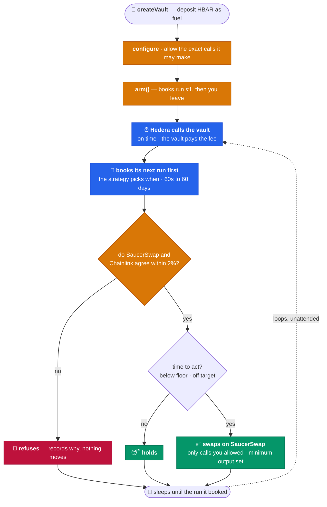
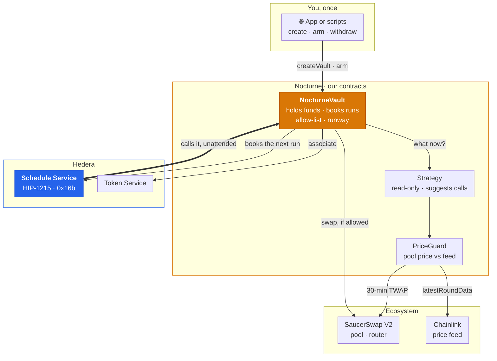

<div align="center">

# 🌙 Nocturne

### Cron for contracts, on Hedera. No server.

**Smart contracts can't wake themselves up, so every on-chain job needs a server to call it.** Nocturne is a Scaffold-HBAR template that removes the server. A vault schedules its own next run with the **Hedera Schedule Service** (HIP-1215), pays the fee from its own balance, and decides when to run again. If the job trades, it only trades when **SaucerSwap** and **Chainlink** agree on the price.

[](https://github.com/Madhav-Gupta-28/Nocturne/actions/workflows/lint.yaml)
[](https://github.com/Madhav-Gupta-28/Nocturne/actions/workflows/scaffold-gate.yaml)


🌐 **[Live app](https://hedera-nocturne.vercel.app)** · 📚 **[Docs](https://hedera-nocturne.vercel.app/docs/quickstart)** · 🟢 **[Guard on duty](https://hashscan.io/testnet/account/0.0.10710268)** · 📄 **[Architecture](ARCHITECTURE.md)**

**[36 runs on testnet](#proven-on-hedera)**, all started by the network · **65.05 HBAR** in fees, paid by the vaults · **0** triggered by a person

</div>

```bash
npm create scaffold-hbar@latest -- nocturne --template Madhav-Gupta-28/Nocturne
```

---

## The problem

A contract only runs when somebody calls it. A stop-loss, a rebalance or a payroll needs somebody to call it on time.

On other chains, you pay a keeper network such as Chainlink Automation to make those calls. Chainlink Automation [doesn't run on Hedera](https://docs.chain.link/chainlink-automation/overview/supported-networks), so teams run their own bot: a server, a cron job and a hot key that must stay up around the clock. When the bot goes down, the job silently stops.

Hedera has a native fix. With [HIP-1215](https://github.com/hiero-ledger/hiero-improvement-proposals/blob/main/HIP/hip-1215.md), a contract can schedule its own future call through the [Schedule Service](https://docs.hedera.com/evm/hedera-services/system-contracts/schedule-service). No bot needed, and Ethereum has no built-in equivalent. But the feature is low-level: we measured [six ways](docs/hedera-landmines.md) a self-scheduling contract stops for good while every transaction still reports `SUCCESS`.

Anything automated that moves money has a second risk: trusting one bad price. In July 2026, a single manipulated oracle price [drained $9.05M from Bonzo Lend](https://www.coindesk.com/web3/2026/07/11/lending-protocol-bonzo-loses-77-of-value-locked-as-usd9-million-oracle-exploit-rattles-hedera).

## What Nocturne is

A template for **contracts that run themselves**. You write the logic, a strategy: one file, four functions. Nocturne gives you the rest:

- **It never stops.** `NocturneVault` schedules its next run *before* doing anything else. If your strategy fails, you lose one run, not the schedule.
- **It pays for itself.** Fees come out of the vault's own HBAR, and `runway()` tells you how many runs are left.
- **It picks its own pace.** The strategy decides when to run next: every six hours when nothing is happening, every minute when something is.
- **It won't trade on a bad price.** A trade goes through only if SaucerSwap's 30-minute average price (TWAP) and a [Chainlink feed](https://docs.chain.link/data-feeds/price-feeds/addresses?network=hedera) agree within 2%. Otherwise the vault refuses and records why.

It ships with three strategies: a **heartbeat** (runs on a fixed schedule), a **protective exit** (sells if the price falls below a floor) and a **drift rebalancer** (keeps a portfolio at a target mix).

> 🔓 **Try it**: [hedera-nocturne.vercel.app](https://hedera-nocturne.vercel.app). Create a vault, arm it and close the tab. Come back later: it will have run on its own, with no transaction from you.

## What you can build

Any repeating job comes down to three questions: **what** to do (`plan`), **when** to run next (`nextInterval`), and **is it safe** right now (`PriceGuard`). Answer them and you have a strategy.

| Job | What each run does | Status |
| --- | --- | --- |
| Stop-loss and depeg guards | Sells below a floor, checking more often as the price gets close | ✅ `ProtectiveExitStrategy`: [sold on testnet](https://hashscan.io/testnet/transaction/1790319308.034520104) |
| Portfolio rebalancing | Trades back to a target mix when it drifts too far | ✅ `DriftRebalanceStrategy`: [rebalanced on testnet](https://hashscan.io/testnet/transaction/1790351600.061675104) |
| Keep-alive and top-ups | Pings a contract or refills a balance on a schedule | ✅ `HeartbeatStrategy` · `TopUpStrategy` |
| Dollar-cost averaging | Buys a fixed amount each interval, only when prices agree | Specified: the [Harness recipe](.harness/README.md) |
| Vesting and payroll | Releases tokens to a fixed payee on a schedule | One file |
| LP fee compounding | Collects fees and adds them back as liquidity | One file |
| Agents that act later | An AI agent sets the plan once. The vault carries it out, and the agent's key never has to be online | One file |

## How it works

You set a vault up once. After that, the network runs it in a loop. **Amber is our code, blue is Hedera acting on its own**, green is an outcome and red is a refusal.



- **Book first, then think.** The next run is scheduled before the strategy runs, and `executeScheduled` never reverts, so nothing can break the loop.
- **The strategy sets the pace.** Every six hours while the price is far from the floor, every minute once it's within 1%.
- **A refusal is recorded, not thrown.** A bad price becomes a readable reason (`sources disagree`, `feed stale`) in a `Refused` event, and the run still completes.
- **The vault pays.** Each fee comes from its own balance. The network won't start a run unless the vault holds about twice the fee, and `runway()` accounts for that.

## From example to template

Hedera's own example, [`AlarmClockSimple`](https://github.com/hedera-dev/hedera-code-snippets/blob/main/hss-schedule-sc-calls/contracts/AlarmClockSimple.sol), is a good way to learn the Schedule Service. Trusting it with money takes more:

| | Hedera's example | Nocturne |
| --- | --- | --- |
| **When it runs** | A fixed interval, set once | The strategy picks each time, 60s to 60 days |
| **Order** | Schedules the next run *after* the work | Schedules the next run *first* |
| **If scheduling fails** | `require` reverts, and the alarm stops for good | Records the failure and when it was due, and anyone can restart it |
| **Free slot** | Not checked | Checks `hasScheduleCapacity` first |
| **Gas** | 2M per run | 3M. Our [DAI sale](https://hashscan.io/testnet/transaction/1790319308.034520104) alone used 2.42M |
| **Fuel** | Not tracked | `runway()` shows runs left |
| **What a run does** | Emits an event | Makes only calls you allowed, and trades only when two prices agree |

## The trust ladder

Automation normally asks you to trust six things. Each rung removes one.

| You'd normally trust | Nocturne | How |
| --- | --- | --- |
| 🖥️ **A keeper server** | Hedera itself calls the vault, at the second it booked | **Schedule Service** (HIP-1215) |
| 🔑 **The keeper's hot key** | There is no key. The scheduled call arrives as the vault calling itself | `msg.sender == address(this)` |
| 🔮 **One price feed** | A DEX price and an oracle must agree, or nothing trades | **SaucerSwap V2** + **Chainlink** |
| 🧩 **The strategy's code** | It can only suggest calls. The vault runs only the exact functions you allowed | `(target, selector)` allow-list |
| ⛽ **Your fuel maths** | `runway()` counts what the network really reserves (3M gas), not just the fee (~1.5M) | `tx.gasprice`, in tinybar |
| 🚪 **Being able to leave** | Withdraw any time, even while it runs. Disarming can't be blocked | `withdrawHbar` · `withdrawToken` |

## Hedera, used end-to-end

What each service does in Nocturne:

| Service | What it does here | Live |
| --- | --- | --- |
| **Schedule Service** | `scheduleCall` books every next run from inside the contract. `hasScheduleCapacity` checks the slot is free first, and `deleteSchedule` cancels a run when you disarm | [guard's runs](https://hashscan.io/testnet/account/0.0.10710268) |
| **SaucerSwap V2** pool | A 30-minute average price (TWAP), read with our own [`TwapLib`](packages/hardhat/contracts/lib/TwapLib.sol) + [`TickMath`](packages/hardhat/contracts/lib/TickMath.sol) | [USDC/DAI pool](https://hashscan.io/testnet/contract/0xb431866114b634f611774ec0d094bf11cb91c7e4) |
| **SaucerSwap V2** router | Makes the trade (`exactInputSingle`), with a minimum output set from the safer of the two prices | [the sale](https://hashscan.io/testnet/transaction/1790319308.034520104) |
| **Chainlink** | The second opinion. Rejected if too old for that feed; decimals normalised | [DAI/USD](https://hashscan.io/testnet/contract/0xdA2aBF7C90aDC73CDF5cA8d720B87bD5F5863389) |
| **Token Service** | The vault associates itself with each HTS token, which Hedera requires before the vault can hold it | [`associate`](packages/hardhat/contracts/NocturneVault.sol) |
| **Mirror Node** | Shows who paid: a scheduled run's transfer list names the vault | [below](#proven-on-hedera) |

We went deep on one service instead of touching five. We found [six ways it fails silently](docs/hedera-landmines.md), measured each on testnet, and guard against every one in the vault.

## Proven on Hedera

Read back off **testnet** on 27 September 2026, across ten vaults. [See the guard on duty](https://hashscan.io/testnet/account/0.0.10710268).

| | |
| --- | --- |
| Runs started by the network, unattended | **36** |
| Fees paid by the vaults themselves | **65.05 HBAR** |
| ↳ acted | **19**: 15 heartbeats, 3 sales, 1 rebalance |
| ↳ refused: prices disagreed | **5** |
| ↳ held, or nothing left to protect | **12** |
| Runs triggered by a person | **0** |

```bash
# count them yourself: no key, no account
for a in 0.0.10684549 0.0.10690925 0.0.10691327 0.0.10691817 0.0.10710164 \
         0.0.10710193 0.0.10710268 0.0.10715956 0.0.10716071 0.0.10716165; do
  curl -s "https://testnet.mirrornode.hedera.com/api/v1/transactions?account.id=$a&limit=100" \
    | jq '[.transactions[] | select(.scheduled and .result == "SUCCESS")] | length'
done | paste -sd+ - | bc      # 36, and growing while the guard runs
```

Same code, same 2% tolerance, three markets:

| Vault | SaucerSwap | Chainlink | What happened | Fee, paid by vault |
| --- | --- | --- | --- | --- |
| [WHBAR](https://hashscan.io/testnet/transaction/1790319391.014683746) | $2.0382 | $0.0920 | **Refused.** 22x apart. Kept all 0.1 WHBAR. | 1.81 HBAR |
| [DAI](https://hashscan.io/testnet/transaction/1790319308.034520104) | $1.0023 | $0.9999 | **Sold.** 0.24% apart. 1 DAI → 1.001757 USDC. | 2.64 HBAR |
| [DAI/USDC](https://hashscan.io/testnet/transaction/1790351600.061675104) | $1.0023 | $0.9999 | **Rebalanced.** 100% DAI vs a 50% target. 0.5 DAI → 0.500878 USDC. | 2.66 HBAR |

**The refusal is the point.** Nobody arbitrages testnet, so SaucerSwap's WHBAR pool sits about 20x above the real HBAR price. To a contract, that looks exactly like a manipulated price. Chainlink put HBAR below the vault's floor, so it wanted to sell. The pool disagreed by 22x, so it refused.

**Who paid?** Check the transfer list, not the transaction ID. The ID names whoever created the schedule. The transfer list shows the vault paid, and no one else:

```bash
curl -s "https://testnet.mirrornode.hedera.com/api/v1/transactions?timestamp=1790319308.034520104" \
  | jq '.transactions[] | {scheduled, result, paid_by: [.transfers[] | select(.amount < 0)]}'
# { "scheduled": true, "result": "SUCCESS", "paid_by": [{ "account": "0.0.10710193", ... }] }
```

After the sale, the DAI vault had nothing left to protect, so it booked its next check **60 days** out instead of burning fuel every minute.

### Live contracts

All verified on Sourcify, so HashScan shows the source.

| | Address | Hedera id |
| --- | --- | --- |
| **NocturneFactory** | [`0xc0f202Ac…4B78`](https://hashscan.io/testnet/contract/0xc0f202Ac01475AFBD07e09643d56bdacC9294B78) | `0.0.10691786` |
| **ProtectiveExitStrategy** | [`0x942bBa07…dBfd`](https://hashscan.io/testnet/contract/0x942bBa07CfC2FAf1dD000C73FF04ccAabC61dBfd) | `0.0.10710158` |
| **DriftRebalanceStrategy** | [`0xfFFc7Da4…5D64`](https://hashscan.io/testnet/contract/0xfFFc7Da411a899e8c76fc4546D63e8e38Fc55D64) | `0.0.10691785` |
| **HeartbeatStrategy** | [`0xA5638e66…2428`](https://hashscan.io/testnet/contract/0xA5638e6682e2FDCC89CEE92Ffc9EC98F3D602428) | `0.0.10685481` |
| **PriceLens** | [`0x7F017Bd0…cCdb`](https://hashscan.io/testnet/contract/0x7F017Bd04879389b2A9CEeD5941EeE75aD28cCdb) | `0.0.10691788` |
| **Heartbeat** | [`0x8b63C92F…ec0b`](https://hashscan.io/testnet/contract/0x8b63C92F7d906862922D060C7Ffc294d8a43ec0b) | `0.0.10684532` |
| **Guard on duty** | [`0xaFa895f7…837f`](https://hashscan.io/testnet/account/0.0.10710268) | `0.0.10710268` |

## Architecture



Only the vault holds your funds or makes calls for you. A strategy only reads and suggests; the vault checks every call against your allow-list before running it.

## Write a strategy

The vault, the fuel accounting and the price guard are already built. A new job is one file that implements this:

```solidity
interface INocturneStrategy {
    // What to do this run. An empty list is a refusal.
    function plan(bytes calldata config) external view returns (Action[] memory);
    // How long to wait before the next run.
    function nextInterval(bytes calldata config) external view returns (uint256);
    // Checked once, when the owner configures the vault.
    function validateConfig(bytes calldata config) external view returns (bool);
    // Why, in words. This is what a Refused event records.
    function explain(bytes calldata config) external view returns (string memory, uint256, uint256);
}
```

The worked example, [`TopUpStrategy`](packages/hardhat/contracts/examples/TopUpStrategy.sol), is under 80 lines and has its own tests. The step-by-step guide is at [/docs/writing-a-strategy](https://hedera-nocturne.vercel.app/docs/writing-a-strategy).

## Tech stack

- **Contracts**: Solidity 0.8.28 · Hardhat · OpenZeppelin · `NocturneVault` · `NocturneFactory` · three strategies · `PriceGuard` / `TwapLib` / `TickMath` · `PriceLens`
- **Hedera**: Schedule Service (HIP-1215) · Token Service · Mirror Node REST · Hashio JSON-RPC · Sourcify
- **Ecosystem**: SaucerSwap V2 (pool TWAP + SwapRouter) · Chainlink price feeds
- **Front end**: Scaffold-HBAR · Next.js App Router · wagmi · RainbowKit · docs served in-app
- **Quality**: 168 offline tests + 5 live · 100% line coverage · zero lint warnings · CI + scaffold gate · [Hedera Harness recipe](.harness/README.md)

## Testing

| Suite | Tests | Covers |
| --- | --- | --- |
| Engine | **67** | Vault, factory, scheduler: arming, the loop surviving failures, early callers, allow-list, fuel, withdrawals, and a Schedule Service that is [missing, reverts or answers short](packages/hardhat/test/NocturneVault.edges.test.ts) |
| Strategies | **75** | Exit, rebalance, heartbeat and the docs example: decisions, timing, every rejected config, end to end |
| Price guard | **26** | Tick maths against the live pool, TWAP rounding, stale, missing and malformed feeds, `PriceLens` |
| [Live](packages/hardhat/test/live/PriceGuardLive.test.ts) | **5** | The deployed guard against the real pool and feed. Read-only, no key |

Coverage on every shipped contract: **100% of lines and functions, 98.8% of statements, 94.3% of branches** (`npm run hardhat:coverage`).

A local chain has no Schedule Service, so a mock ([`MockHederaScheduleService`](packages/hardhat/contracts/test/MockHederaScheduleService.sol)) is installed at its address, `0x16b`. It follows the real rules: errors come back as response codes, not reverts; one booking per transaction; nothing past 62 days.

CI runs on Node 20 and 22. A second workflow, the [scaffold gate](.github/workflows/scaffold-gate.yaml), creates a fresh project with the official CLI, the way a new user would, then tests, builds and boots it, on every push and daily.

## Security notes

- **The loop can't break.** `executeScheduled` never reverts, because a revert would cancel the next booking too. Early or disarmed calls just return, and a failing `plan` is caught.
- **Permissions are per function.** Allowing `approve` on a token doesn't allow `transfer`. If one suggested call isn't allowed, the whole plan is rejected before anything runs.
- **A plan can't move HBAR.** Any call that sends value, or names no function, is refused.
- **New strategy, clean slate.** Switching strategy (`setStrategy`) wipes every permission given to the old one.
- **Strategies can't write state.** `plan` is called read-only, and [a test](packages/hardhat/test/NocturneVault.test.ts) tries to break that.
- **No early runs by outsiders.** Calls more than 10 seconds before the booked time are ignored.
- **You can always leave.** Withdrawals work in any state, and disarming succeeds even if the network refuses to cancel the schedule.
- **Known limit, pinned by a test:** if a swap fails after its `approve`, the approval stays. It can only point at the router you configured, and the next run replaces it.

## Quick start

**Prerequisites:** Node 20.18.3+, npm, and a testnet account with ~40 HBAR from the [faucet](https://portal.hedera.com/faucet).

```bash
npm create scaffold-hbar@latest -- nocturne --template Madhav-Gupta-28/Nocturne
cd nocturne
```

Keep the `--`: without it, `--template` never reaches the CLI. If GitHub rate-limits the CLI, it quietly falls back to Foundry; adding `-f nextjs-app -s hardhat --package-manager npm` prevents that.

**Environment.** Everything has a testnet default. The only value you create is the deployer key, and a script writes it for you.

| Variable | File | What it is |
| --- | --- | --- |
| `DEPLOYER_PRIVATE_KEY_ENCRYPTED` | `packages/hardhat/.env` | Written by `npm run hardhat:account:generate`. Encrypted. |
| `HEDERA_RPC_URL` | `packages/hardhat/.env` | Optional. Default Hashio testnet. |
| `NEXT_PUBLIC_HEDERA_TESTNET_RPC_URL` | `packages/nextjs/.env.local` | Optional. Default Hashio testnet. |
| `NEXT_PUBLIC_HEDERA_MAINNET_RPC_URL` | `packages/nextjs/.env.local` | Optional. Default Hashio mainnet. |
| `NEXT_PUBLIC_WALLET_CONNECT_PROJECT_ID` | `packages/nextjs/.env.local` | Optional. A shared dev ID is included. |
| `HEDERA_MIRROR_TESTNET_URL` | `packages/nextjs/.env.local` | Optional. Default public mirror node. |

**Run it.**

```bash
npm run hardhat:test                                   # 168 tests, no network
npm run hardhat:test:live                              # the live guard, read-only
npm run hardhat:account:generate                       # then fund it at the faucet
npm run hardhat:deploy -- --network hederaTestnet      # six contracts
npm run next:dev                                       # http://localhost:3000
```

**Budget for the reserve, not the fee.** A check costs about 1.8 HBAR (a trade, a bit more), but the network won't start one unless the vault holds about twice that. So 24 HBAR buys about a dozen runs. The app shows the count before you create a vault.

## Repository layout

```
packages/hardhat/
  contracts/        vault · factory · PriceLens · Heartbeat
    strategies/     heartbeat · protective exit · drift rebalance
    lib/            PriceGuard · TwapLib · TickMath
    examples/       TopUpStrategy, the one the docs walk through
    test/           mocks: scheduler, pool, feed, router, HTS
  scripts/          arm and watch vaults from a terminal
  test/             168 offline tests · live/ for the 5 against testnet
packages/nextjs/    the app: landing, how it works, create / arm / watch, docs
docs/               the docs pages the app serves
.harness/           Hedera Harness recipe: spec, PRD, validators
```

## Roadmap

- **More strategies, same engine.** DCA is already specified in the [Harness recipe](.harness/README.md). Loan protection and vesting are next.
- **A sponsor that pays.** HIP-1215's `scheduleCallWithPayer` would let a protocol pay for its users' runs.
- **Mainnet**, after a professional audit of `NocturneVault` and the price guard.

## Built on Scaffold-HBAR

Next.js, wagmi + RainbowKit, Hardhat, Hashio and Mirror Node config, the Debug Contracts page and the block explorer are all kept. Two fixes on top: a root `.npmrc` so a workspace install doesn't fail with ERESOLVE, and `@x402/*` aliased out so `npm run next:build` passes.

## Licence

[MIT](LICENCE).

<div align="center">

🌐 **[Live app](https://hedera-nocturne.vercel.app)** · 📚 **[Docs](https://hedera-nocturne.vercel.app/docs/quickstart)** · 📄 **[Architecture](ARCHITECTURE.md)** · 🤖 **[AGENTS.md](AGENTS.md)**

</div>
