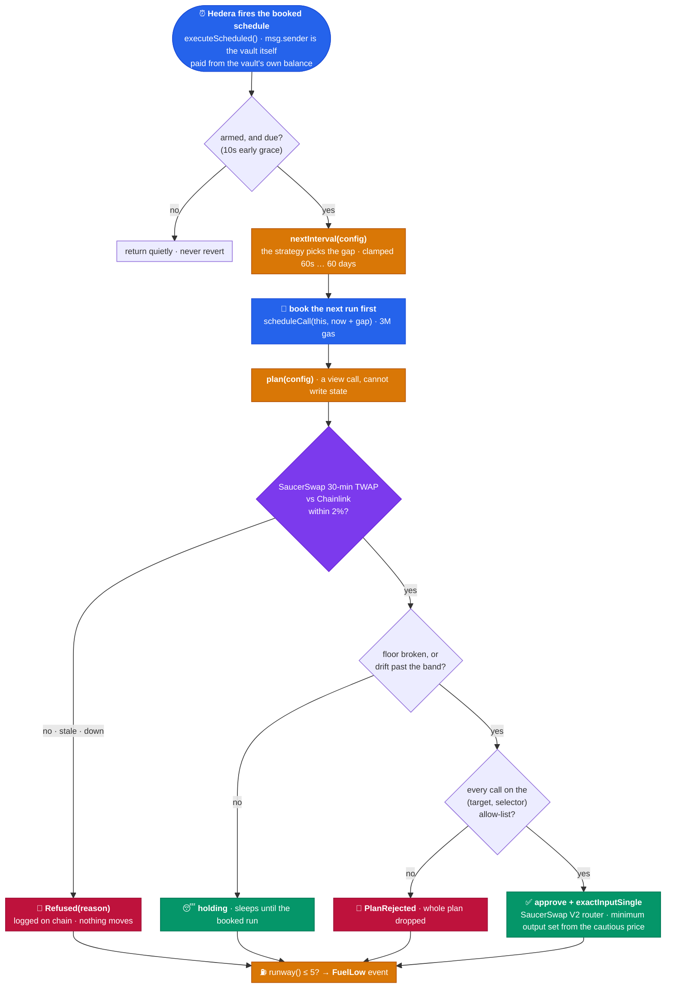
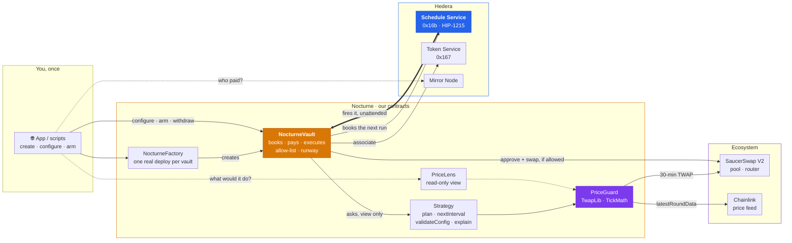

<div align="center">

# 🌙 Nocturne

### Cron for contracts, on Hedera. No server.

**A contract can't wake itself up, so every on-chain job ends up needing a server.** Nocturne is a Scaffold-HBAR template that removes it. A vault books its own next run through the **Hedera Schedule Service** (HIP-1215), pays for that run from its own balance, and decides how soon to look again. When a job moves money, it won't trade unless **SaucerSwap** and **Chainlink** agree on the price.

[](https://github.com/Madhav-Gupta-28/Nocturne/actions/workflows/lint.yaml)
[](https://github.com/Madhav-Gupta-28/Nocturne/actions/workflows/scaffold-gate.yaml)


🌐 **[Live app](https://hedera-nocturne.vercel.app)** · 📚 **[Docs](https://hedera-nocturne.vercel.app/docs/quickstart)** · 🧭 **[How it works](https://hedera-nocturne.vercel.app/how-it-works)** · 🟢 **[Guard on duty](https://hashscan.io/testnet/account/0.0.10710268)**

</div>

```bash
npm create scaffold-hbar@latest -- nocturne --template Madhav-Gupta-28/Nocturne
```


## Judging? Five checks, about ten minutes

| # | Do this | You should see |
| --- | --- | --- |
| 1 | Open the [guard on duty](https://hashscan.io/testnet/account/0.0.10710268) | A DAI depeg guard. A scheduled `CONTRACT CALL` every six hours, each paid from the vault's own balance. |
| 2 | Open the [refusal](https://hashscan.io/testnet/transaction/1790319391.014683746), the [sale](https://hashscan.io/testnet/transaction/1790319308.034520104) and the [rebalance](https://hashscan.io/testnet/transaction/1790351600.061675104) | Three scheduled transactions that nobody sent. The vault paid for each one ([how to check](#check-it-yourself)). |
| 3 | `cd nocturne && npm run hardhat:test` | 168 passing. No network, no keys. |
| 4 | `npm run hardhat:test:live` | The deployed guard reads the real SaucerSwap pool and Chainlink feed. They are about 20x apart, so it refuses. Read-only: no key, no HBAR. |
| 5 | `npm run next:dev`, connect a testnet wallet, create a Heartbeat vault with 24 HBAR, then close the tab | The run counter keeps moving. None of the runs come from your wallet. |

---

## The problem

Smart contracts only run when somebody calls them. Anything that should happen *later*, like a stop-loss, a rebalance, a payroll or a vesting release, needs somebody to show up and call it.

On other EVM chains, that somebody is rented. Chainlink Automation and Gelato run keeper networks for exactly this, and Chainlink Automation [isn't available on Hedera](https://docs.chain.link/chainlink-automation/overview/supported-networks). So a Hedera team runs its own bot: a server, a cron job and a hot key, all of which have to be up at 3am. When the bot stops, the job stops, and nothing on chain tells you.

Hedera already has the fix built in. The **Schedule Service** (HIP-1215) lets a contract book a call to itself in the future. But it is raw, and it fails quietly: we measured **six ways** that a self-scheduling contract stops for good while every transaction reports `SUCCESS`. None of them are in Hedera's docs.

Automation that moves money has a second problem: it acts on a price nobody is watching. On 11 July 2026 a single manipulated oracle price took [$9.05M out of Bonzo Lend](https://www.coindesk.com/web3/2026/07/11/lending-protocol-bonzo-loses-77-of-value-locked-as-usd9-million-oracle-exploit-rattles-hedera), 77% of its TVL. An automated seller that trusts one feed is a liquidation bot working for whoever moved the price.

## What Nocturne is

A template for **contracts that run themselves**. You write a strategy, which is one file and four functions. Nocturne supplies everything around it:

- **The engine.** `NocturneVault` books its own next run through the Schedule Service, *before* doing any work, so a failing strategy costs one run and never the chain.
- **The fuel.** The vault pays for every run from its own balance, and `runway()` tells you how many are left, counted the way the network actually counts.
- **The pace.** The strategy picks the interval each time: six hours when nothing is close, sixty seconds when something is.
- **The guard.** A strategy that trades has to get past `PriceGuard`: a 30-minute SaucerSwap V2 TWAP and a Chainlink feed that must agree within 2%, or the vault refuses and logs why.

It ships three strategies with three different shapes: a **heartbeat** (fixed cadence), a **protective exit** (sell below a floor, one-way) and a **drift rebalancer** (hold a ratio, two-way). All three run on the same unchanged engine.

> 🔓 **Try it**: [hedera-nocturne.vercel.app](https://hedera-nocturne.vercel.app). Connect a testnet wallet, create a vault, arm it and close the tab. Come back later and the run counter will have moved. No transaction in the vault's history will have come from you.

## How it works

One run, from the network's wake-up call to the next booking. **Amber is our code, blue is Hedera acting on its own, purple is the price guard**, green is an ending and red is a refusal.



- **The successor is booked before the plan runs.** A strategy that reverts costs one run, not the chain. `executeScheduled` never reverts.
- **The strategy sets the pace.** `ProtectiveExitStrategy` asks for six hours when the price is far above its floor and sixty seconds when it is within 1%. Hedera's own `ScheduledVault` example takes a fixed interval, so it can't express this.
- **Refusing is a result, not an error.** Every bad reading comes back as a reason (`sources disagree`, `feed stale`, `pool has no window yet`) and lands in a `Refused` event.
- **The vault pays.** Each run is charged to the vault's balance, and `runway()` counts against the reserve the network demands, which is twice what a run is charged.


### Your side of it

Everything you do happens before the first run. After `arm`, nothing needs you.

```mermaid
---
config:
  flowchart:
    nodeSpacing: 24
    rankSpacing: 40
    useMaxWidth: true
  themeVariables:
    fontSize: 12px
---
flowchart LR
    A(["scaffold the<br/>template"]) --> B["deploy<br/>factory + strategies"]
    B --> C["<b>createVault</b><br/>with HBAR as fuel"]
    C --> D["associate tokens<br/>deposit the position"]
    D --> E["allow exact calls<br/>(target, selector)"]
    E --> F["<b>configure</b><br/>validated on the spot"]
    F --> G["<b>arm</b><br/>books run #1"]
    G --> H(["🌙 close the tab"])
    H -.->|"hours or weeks later"| I["runs itself<br/>refuses · holds · sells"]
    I -.-> J["top up · withdraw<br/>disarm, any time"]

    style G fill:#D97706,stroke:#B45309,color:#FFFFFF
    style H fill:#2563EB,stroke:#1D4ED8,color:#FFFFFF
    style I fill:#2563EB,stroke:#1D4ED8,color:#FFFFFF
```



The app does steps 3 to 7 in one screen for each strategy. The scripts in `packages/hardhat/scripts/` do them from a terminal.

## The trust ladder

Automation normally asks you to trust six things. Each rung removes one.

| You'd normally trust | Nocturne | Hedera primitive |
| --- | --- | --- |
| 🖥️ **A keeper server** to show up on time | The network calls the vault at the second it booked | **Schedule Service** (HIP-1215) |
| 🔑 **The keeper's hot key** | There isn't one. A scheduled call arrives as the vault calling itself | `msg.sender == address(this)` |
| 🔮 **One price feed** | Two sources must agree, a DEX TWAP and an oracle, or nothing trades | **SaucerSwap V2** + **Chainlink** |
| 🧩 **The strategy's code** | It can only propose. The vault runs calls the owner allowed by exact `(target, selector)`, and nothing that moves HBAR | `_callsAllowed` |
| ⛽ **Your fuel arithmetic** | `runway()` counts the 3M-gas reserve the network checks, not the ~1.5M it charges | `tx.gasprice`, in tinybar |
| 🚪 **Being able to leave** | Withdraw HBAR and tokens at any time, armed or not. `disarm` cannot be blocked by the network | `onlyOwner`, no lock |

## Hedera and its ecosystem, load-bearing

Take away any row and a shipped strategy stops working.

| Capability | What Nocturne does with it | Live |
| --- | --- | --- |
| **Schedule Service** · `scheduleCall` | Every run books the next from inside the contract, with the gap the strategy asked for | [guard's runs](https://hashscan.io/testnet/account/0.0.10710268) |
| **Schedule Service** · `hasScheduleCapacity` | Checked before booking. If a second is full, the vault records when it *should* run, so anyone can revive it | [`_bookNext`](packages/hardhat/contracts/NocturneVault.sol) |
| **Schedule Service** · `deleteSchedule` | Releases the pending run on disarm or reconfigure, or when someone other than the network runs the vault | [`_releaseSchedule`](packages/hardhat/contracts/NocturneVault.sol) |
| **SaucerSwap V2** · pool `observe` | A 30-minute TWAP, through our own [`TwapLib`](packages/hardhat/contracts/lib/TwapLib.sol) and [`TickMath`](packages/hardhat/contracts/lib/TickMath.sol) (MIT, written from scratch) | [USDC/DAI pool](https://hashscan.io/testnet/contract/0xb431866114b634f611774ec0d094bf11cb91c7e4) |
| **SaucerSwap V2** · `exactInputSingle` | The trade itself, with `amountOutMinimum` set from the more cautious of the two prices | [the sale](https://hashscan.io/testnet/transaction/1790319308.034520104) |
| **Chainlink** · `latestRoundData` | The second opinion. Staleness is checked against each feed's own heartbeat, and decimals are normalised | [DAI/USD](https://hashscan.io/testnet/contract/0xdA2aBF7C90aDC73CDF5cA8d720B87bD5F5863389) |
| **Token Service** · `associateToken` | The vault associates itself with every HTS token it will hold, before custody | [`associate`](packages/hardhat/contracts/NocturneVault.sol) |
| **Mirror Node** | The proof: a scheduled transaction's transfer list shows the vault paid | [check it yourself](#check-it-yourself) |

**Depth over breadth.** You could call five Hedera services once each and list them all. Nocturne builds on one, the Schedule Service, and pushes it until it breaks. The six ways it breaks are [written down and reproducible](docs/hedera-landmines.md). Everything else on this list is there because the engine needs it.

## Proven on Hedera

Read back off **testnet** on 27 September 2026: ten vaults, three owners, across the factory's versions.

| | |
| --- | --- |
| Runs executed by the network, unattended | **32** |
| HBAR those runs cost, paid by the vaults themselves | **57.94** |
| ↳ executed a plan | **19**: 15 heartbeats, 3 sales, 1 rebalance |
| ↳ refused because the sources disagreed | **5** |
| ↳ held above the floor, or had nothing left to protect | **8** |
| Runs any owner sent | **0** |
| Vaults stopped by `INSUFFICIENT_PAYER_BALANCE` ([landmine 5](docs/hedera-landmines.md)) | **4**, left to run dry. Two still hold over 2.6 HBAR each |

```bash
# count them yourself: no key, no account
for a in 0.0.10684549 0.0.10690925 0.0.10691327 0.0.10691817 0.0.10710164 \
         0.0.10710193 0.0.10710268 0.0.10715956 0.0.10716071 0.0.10716165; do
  curl -s "https://testnet.mirrornode.hedera.com/api/v1/transactions?account.id=$a&limit=100" \
    | jq '[.transactions[] | select(.scheduled and .result == "SUCCESS")] | length'
done | paste -sd+ - | bc      # 32, and growing while the guard is on duty
```


Same engine, same stock 2% tolerance, three markets:

| Vault | SaucerSwap | Chainlink | What happened | Paid by the vault | Transaction |
| --- | --- | --- | --- | --- | --- |
| WHBAR [`0.0.10710164`](https://hashscan.io/testnet/contract/0.0.10710164) | $2.0382 | $0.0920 | **Refused.** 22x apart. Kept all 0.1 WHBAR. | 1.81 HBAR | [HashScan](https://hashscan.io/testnet/transaction/1790319391.014683746) |
| DAI [`0.0.10710193`](https://hashscan.io/testnet/contract/0.0.10710193) | $1.0023 | $0.9999 | **Sold.** 0.24% apart: approve + swap, 1 DAI → 1.001757 USDC. | 2.64 HBAR | [HashScan](https://hashscan.io/testnet/transaction/1790319308.034520104) |
| DAI/USDC [`0.0.10716165`](https://hashscan.io/testnet/contract/0.0.10716165) | $1.0023 | $0.9999 | **Rebalanced.** Held 100% DAI against a 50% target, so sold 0.5 DAI → 0.500878 USDC. | 2.66 HBAR | [HashScan](https://hashscan.io/testnet/transaction/1790351600.061675104) |

**The refusal is the point.** The testnet WHBAR/USDC pool has drifted to about 20x the real HBAR price, because nobody arbitrages testnet. That is exactly what a manipulated price looks like from inside a contract. The WHBAR vault's floor was broken by Chainlink's number, it held the asset, and it still declined to sell into a price it couldn't corroborate.

**It stops paying for nothing.** After the sale, the DAI vault's next run found nothing left to protect and booked its next check **60 days** out, rather than every minute until its fuel ran out.

**One vault is still on duty.** A DAI depeg guard at [`0.0.10710268`](https://hashscan.io/testnet/account/0.0.10710268), floor $0.85, checks every six hours and pays for each check itself.

### Check it yourself

Who paid for the sale? The mirror node says the vault, and only the vault:

```bash
curl -s "https://testnet.mirrornode.hedera.com/api/v1/transactions?timestamp=1790319308.034520104" \
  | jq '.transactions[] | {scheduled, result, paid_by: [.transfers[] | select(.amount < 0)]}'
```

```json
{ "scheduled": true, "result": "SUCCESS",
  "paid_by": [{ "account": "0.0.10710193", "amount": -263671981 }] }
```

**Read the transfer list, not the transaction id.** A scheduled transaction's id names whoever *created* the schedule, so it looks as if someone sent the call. The transfer list shows who actually paid. On HashScan, scheduled runs appear on the vault's **account** page. The contract page lists only calls sent over JSON-RPC.

The refusal can be reproduced right now, before you arm anything: `npm run hardhat:test:live` reads the real pool and feed through the deployed `PriceLens` and asserts that the guard refuses.

## Architecture



The vault is the only contract that holds your funds or makes calls on your behalf. A strategy is a view-only advisor: it reads, and it returns a list of calls. The vault checks every call against the owner's allow-list before running any of them.

| Contract | Role |
| --- | --- |
| [`NocturneVault`](packages/hardhat/contracts/NocturneVault.sol) | Holds funds, books schedules, runs plans. Never reverts inside a scheduled call. |
| [`NocturneFactory`](packages/hardhat/contracts/NocturneFactory.sol) | One vault per call, funded at birth. Real deploys, never clones, because clones can't schedule. |
| [`INocturneStrategy`](packages/hardhat/contracts/interfaces/INocturneStrategy.sol) | Four functions: `plan`, `nextInterval`, `validateConfig`, `explain`. |
| [`HeartbeatStrategy`](packages/hardhat/contracts/strategies/HeartbeatStrategy.sol) | Fixed cadence. The smallest strategy that works. |
| [`ProtectiveExitStrategy`](packages/hardhat/contracts/strategies/ProtectiveExitStrategy.sol) | Sells to a floor. One-way and urgent. Parks for 60 days once empty. |
| [`DriftRebalanceStrategy`](packages/hardhat/contracts/strategies/DriftRebalanceStrategy.sol) | Holds a ratio. Two-way, and skips trades that cost more than they fix. |
| [`PriceGuard`](packages/hardhat/contracts/lib/PriceGuard.sol) | Two sources, one verdict. Never reverts: every failure becomes a reason. |
| [`PriceLens`](packages/hardhat/contracts/PriceLens.sol) | The guard behind a view-only address, so the app sees what a vault would see. |

Full detail, with every chain fact marked measured or assumed: [`ARCHITECTURE.md`](ARCHITECTURE.md).

## Write your own strategy

The vault, the fuel accounting and the price guard are already written, so a new job is one file:

```solidity
interface INocturneStrategy {
    function plan(bytes calldata config) external view returns (Action[] memory);
    function nextInterval(bytes calldata config) external view returns (uint256);
    function validateConfig(bytes calldata config) external view returns (bool);
    function explain(bytes calldata config) external view returns (string memory, uint256, uint256);
}
```

An empty plan is a refusal, and `explain` says why. The worked example, [`TopUpStrategy`](packages/hardhat/contracts/examples/TopUpStrategy.sol), keeps a balance topped up in under 80 lines and has its own tests. The guide is [writing a strategy](docs/writing-a-strategy.md).

| Job | Status |
| --- | --- |
| Stop-loss and depeg guards | ✅ **Ships today**: `ProtectiveExitStrategy` |
| Portfolio rebalancing | ✅ **Ships today**: `DriftRebalanceStrategy` |
| Heartbeats | ✅ **Ships today**: `HeartbeatStrategy` |
| Dollar-cost averaging | Specified: the [Harness recipe](.harness/README.md) asks an agent to build it |
| Loan protection before liquidation | One file away |
| Vesting and payroll | One file away |
| LP fee compounding | One file away |
| AI agents that must act later | One file away |

## Six ways HSS automation fails silently

All measured on testnet. None are in Hedera's docs. Each comes with the command that reproduces it in [`docs/hedera-landmines.md`](docs/hedera-landmines.md).

| # | What goes wrong | What you see | Nocturne's guard |
| --- | --- | --- | --- |
| 1 | 1M gas for a call that reschedules itself | `SUCCESS`, then nothing, ever | `MIN_SCHEDULE_GAS = 3M` |
| 2 | Scheduled calls see a clock ~2s early | A deadline check reverts | `CLOCK_SKEW = 10s` |
| 3 | A second booking in one transaction | The whole run fails | One `_bookNext` per run |
| 4 | A schedule more than 62 days out | Refused by response code, no revert | `MAX_INTERVAL = 60 days` |
| 5 | Payer checked against gas *reserved*, not gas burned | [Dies with 2.76 HBAR still in it](https://hashscan.io/testnet/transaction/1790184109.000053722) | `runway()` counts the reserve |
| 6 | Balance read during a run | Looks 3.27 HBAR poorer than it is | Nothing acts on it mid-run |

Number 5 is the expensive one. A run is charged about 1.6 HBAR, but the network won't start it unless the payer holds the full 3M-gas reserve, about 3.3 HBAR. Fund a vault by the charge and it stops with money still in it. Four of our own vaults ran into it, and two are still sitting on more than 2.6 HBAR they can't spend.

## Quick start

### Prerequisites

- Node **20.18.3** or newer (CI runs 20.18.3 and 22)
- npm (the only package manager `template.json` declares)
- A Hedera testnet account with about **40 HBAR** from the [portal faucet](https://portal.hedera.com/faucet)
- Optional, for checking claims: `curl` and `jq`

### Scaffold

```bash
npm create scaffold-hbar@latest -- nocturne --template Madhav-Gupta-28/Nocturne
cd nocturne
```

The `--` is required. Without it, `--template` is consumed by npm, and you land in the stock template picker.

> **If GitHub rate-limits the CLI, you get the wrong project.** The CLI reads `template.json` through the GitHub API. When that call fails it quietly falls back to Foundry, and `packages/hardhat` is dropped. Pin the choices and the API call stops mattering:
>
> ```bash
> npm create scaffold-hbar@latest -- nocturne --template Madhav-Gupta-28/Nocturne \
>   -f nextjs-app -s hardhat --package-manager npm
> ```

### Environment variables

Every variable has a working testnet default. The only one you must create is the deployer key, and a script writes it for you.

| Variable | File | Required | What it is |
| --- | --- | --- | --- |
| `DEPLOYER_PRIVATE_KEY_ENCRYPTED` | `packages/hardhat/.env` | to deploy | Written by `npm run hardhat:account:generate` (or `:import`). Password-encrypted. Never paste a raw key. |
| `HEDERA_RPC_URL` | `packages/hardhat/.env` | no | JSON-RPC for Hardhat. Default `https://testnet.hashio.io/api`. |
| `NEXT_PUBLIC_HEDERA_TESTNET_RPC_URL` | `packages/nextjs/.env.local` | no | Frontend RPC. Default Hashio testnet. |
| `NEXT_PUBLIC_HEDERA_MAINNET_RPC_URL` | `packages/nextjs/.env.local` | no | Frontend RPC. Default Hashio mainnet. |
| `NEXT_PUBLIC_WALLET_CONNECT_PROJECT_ID` | `packages/nextjs/.env.local` | no | Your WalletConnect id. The scaffold ships a shared one for development. |
| `HEDERA_MIRROR_TESTNET_URL` | `packages/nextjs/.env.local` | no | Mirror node for the account API route. Default public testnet. |

### Run it

```bash
npm run hardhat:test                                   # 168 tests, no network
npm run hardhat:coverage                               # 100% of lines in every shipped contract
npm run hardhat:account:generate                       # then fund it at the faucet
npm run hardhat:deploy -- --network hederaTestnet      # six contracts
npm run hardhat:verify:sourcify -- --network hederaTestnet
npm run next:dev                                       # http://localhost:3000
```

<details>
<summary><b>Arm a vault from the terminal</b></summary>

```bash
cd packages/hardhat
FUEL_HBAR=12 INTERVAL=120 npx hardhat run scripts/armVault.ts --network hederaTestnet          # a heartbeat
PRESET=refuse npx hardhat run scripts/armExitVault.ts --network hederaTestnet                  # the WHBAR refusal
PRESET=sell   npx hardhat run scripts/armExitVault.ts --network hederaTestnet                  # the DAI sale
npx hardhat run scripts/armRebalanceVault.ts --network hederaTestnet                           # the rebalance
npx hardhat run scripts/watchVault.ts --network hederaTestnet                                  # reads only
```

The exit presets are `refuse`, `sell` and `guard`. Every one uses the same code and the same 2% tolerance. Only the market they point at differs.

</details>

<details>
<summary><b>Budget the fuel</b></summary>

**Budget against the reserve, not the charge.** A run needs the 3M-gas reserve in the vault to be accepted (3.27 HBAR at 109 tinybar per gas), and is then charged for about 1.5M gas (about 1.6 HBAR at that price, 1.78 at the price when this was written). Runway is `(balance − reserve) / charge + 1`, which is what `runway()` returns and what the app shows before you create a vault. 24 HBAR buys about a dozen runs.

**The owner's wallet needs headroom too.** The relay won't submit a transaction unless the sender holds its whole gas limit: about 4.6 HBAR to create a vault (4M gas) and about 2.9 to arm it (2.5M), on top of the fuel. A wallet that prices gas EIP-1559 style asks for about twice that. The app and the scripts send the network price as a legacy `gasPrice`, so the lower figure applies. Details are in [fuel and runway](docs/fuel.md).

</details>

<details>
<summary><b>Extend it with a coding agent</b></summary>

[`AGENTS.md`](AGENTS.md) briefs Cursor, Codex and Claude Code on the project's rules. The [Hedera Harness recipe](.harness/README.md) asks a coding agent to add a DCA strategy and grades the result: `npm run harness:validate` checks the recipe with no agent, and `npm run harness:run` runs one. It was verified both ways: without the strategy it reports exactly 5 findings, and with a correct one it reports 0.

</details>

## Documentation

Seven pages, served by the app at [`/docs`](https://hedera-nocturne.vercel.app/docs/quickstart), with the diagrams drawn in:

| Page | For |
| --- | --- |
| [Quickstart](docs/quickstart.md) | From nothing to a running vault |
| [Writing a strategy](docs/writing-a-strategy.md) | The four functions, a worked example, the gas budget |
| [Vault reference](docs/vault-reference.md) | Every function, event and error on the vault and factory |
| [Fuel and runway](docs/fuel.md) | Reserve vs charge, tinybar vs weibar, wallet headroom |
| [Architecture](docs/architecture.md) | How the pieces fit, and why each boundary is where it is |
| [Hedera landmines](docs/hedera-landmines.md) | The six silent failures, each with a reproduction |
| [Dead ends](docs/dead-ends.md) | What we tried that didn't work, so you don't have to |


## Testing

| Suite | Tests | Covers |
| --- | --- | --- |
| Engine: vault, factory, scheduler mock | **67** | Arming, clamping, chain survival, early callers, the allow-list, fuel, withdrawals, and a Schedule Service that is [missing, reverts or answers short](packages/hardhat/test/NocturneVault.edges.test.ts) |
| Strategies | **75** | Exit, rebalance, heartbeat and the docs example: decisions, cadence, every config rejection, end to end on the vault |
| Price guard | **26** | Tick maths against the live pool's numbers, TWAP rounding, stale, missing and malformed feeds, [`PriceLens`](packages/hardhat/contracts/PriceLens.sol) |
| [Live](packages/hardhat/test/live/PriceGuardLive.test.ts) | **5** | The deployed guard against the real SaucerSwap pool and Chainlink feed. Read-only |

Coverage on every contract the template ships: **100% of lines, 100% of functions, 98.8% of statements, 94.3% of branches.**

```bash
npm run hardhat:coverage
```

The Schedule Service is a precompile, so a local chain doesn't have one. [`MockHederaScheduleService`](packages/hardhat/contracts/test/MockHederaScheduleService.sol) is installed at `0x16b` with `hardhat_setCode`, and it follows the real one's rules: it signals failure by response code rather than revert, allows one booking per transaction, and refuses anything more than 62 days out. The run tests fire it, advance the clock and fire again, with no transaction from the owner.

CI runs compile, tests, lint, typecheck and build on Node 20.18.3 and 22. A second workflow, [scaffold gate](.github/workflows/scaffold-gate.yaml), scaffolds a fresh project from this repo with the published CLI, then tests it, builds it, boots it and loads every core route. It runs on every push and daily.

### Security notes

- **`executeScheduled` never reverts.** An early or unarmed call returns. A reverting `plan` is caught, and a reverting `nextInterval` falls back to 60 days. A revert here would take the successor booking with it.
- **Consent is per `(target, selector)`, not per address.** Allowing a token so a strategy can `approve` would otherwise also allow `transfer(attacker, balance)`. A plan with any call off the list is rejected whole, before anything runs.
- **A plan can't move HBAR.** An action with non-zero `value`, or with no function selector, is refused. That also keeps `runway()` honest, since gas is then the only thing the balance pays for.
- **Replacing the strategy retires every grant.** `setStrategy` bumps a grant epoch, so permissions given to one strategy never carry over to the next.
- **Strategies are view-only.** `plan` is called as a view, so a strategy can't write state. [A test](packages/hardhat/test/NocturneVault.test.ts) tries.
- **An outsider can't force a run early.** Calls more than 10 seconds before the booked time are ignored. When someone other than the network does run the vault, it releases the schedule that run replaced, so the vault isn't charged twice.
- **The owner can always leave.** Withdrawals aren't gated on state, and `disarm` succeeds even when the network refuses to delete the schedule. A schedule that outlives it finds the vault unarmed and does nothing.
- **No swap without a floor.** `amountOutMinimum` is never zero. It is set from the more cautious of the two prices, less a slippage the config must keep between 0 and 100%.
- **Known limitation, pinned by a test:** if the swap in `[approve, swap]` reverts, the approve has already landed. The allowance can only point at the configured router, and the next run overwrites it.

## Tech stack

- **Contracts**: Solidity 0.8.28 · Hardhat · OpenZeppelin · `NocturneVault` · `NocturneFactory` · three strategies · `PriceGuard` / `TwapLib` / `TickMath` · `PriceLens`
- **Hedera**: Schedule Service (HIP-1215) · Token Service · Mirror Node REST · Hashio JSON-RPC · Sourcify verification
- **Ecosystem**: SaucerSwap V2 (pool TWAP + SwapRouter) · Chainlink price feeds
- **Front end**: Scaffold-HBAR · Next.js App Router · wagmi · RainbowKit · docs served from `docs/` with the diagrams drawn in
- **Quality**: 168 offline tests + 5 live · 100% line coverage · zero lint warnings · CI on Node 20 and 22 · scaffold gate · Hedera Harness recipe

## Repository layout

```
packages/hardhat/
  contracts/            vault · factory · PriceLens · Heartbeat
    strategies/         heartbeat · protective exit · drift rebalance
    lib/                PriceGuard · TwapLib · TickMath
    interfaces/         INocturneStrategy · Schedule Service · HTS · SaucerSwap · Chainlink
    examples/           TopUpStrategy, the one the docs walk through
    test/               mocks: scheduler, pool, feed, router, HTS, plus two on-chain probes
  deploy/               factory, strategies and lens in one script
  scripts/              arm, watch, and the testnet token helpers
  test/                 168 offline tests · live/ for the 5 against testnet
packages/nextjs/        the app: landing, how it works, create / arm / watch, docs
docs/                   the seven docs pages and the README images
.harness/               the Hedera Harness recipe: spec, PRD, validators
```

## Deployed on testnet

All Sourcify-verified, so HashScan shows the source.

| Contract | Address | Hedera id |
| --- | --- | --- |
| NocturneFactory | [`0xc0f202Ac01475AFBD07e09643d56bdacC9294B78`](https://hashscan.io/testnet/contract/0xc0f202Ac01475AFBD07e09643d56bdacC9294B78) | `0.0.10691786` |
| ProtectiveExitStrategy | [`0x942bBa07CfC2FAf1dD000C73FF04ccAabC61dBfd`](https://hashscan.io/testnet/contract/0x942bBa07CfC2FAf1dD000C73FF04ccAabC61dBfd) | `0.0.10710158` |
| DriftRebalanceStrategy | [`0xfFFc7Da411a899e8c76fc4546D63e8e38Fc55D64`](https://hashscan.io/testnet/contract/0xfFFc7Da411a899e8c76fc4546D63e8e38Fc55D64) | `0.0.10691785` |
| HeartbeatStrategy | [`0xA5638e6682e2FDCC89CEE92Ffc9EC98F3D602428`](https://hashscan.io/testnet/contract/0xA5638e6682e2FDCC89CEE92Ffc9EC98F3D602428) | `0.0.10685481` |
| PriceLens | [`0x7F017Bd04879389b2A9CEeD5941EeE75aD28cCdb`](https://hashscan.io/testnet/contract/0x7F017Bd04879389b2A9CEeD5941EeE75aD28cCdb) | `0.0.10691788` |
| Heartbeat | [`0x8b63C92F7d906862922D060C7Ffc294d8a43ec0b`](https://hashscan.io/testnet/contract/0x8b63C92F7d906862922D060C7Ffc294d8a43ec0b) | `0.0.10684532` |
| **Guard on duty** | [`0xaFa895f727Fb0287fCB3E08DD9dA13287356837f`](https://hashscan.io/testnet/account/0.0.10710268) | `0.0.10710268` |

## Rubric map

| Criterion | Where to look |
| --- | --- |
| **Ecosystem integration** | SaucerSwap V2 (TWAP and router swap) and Chainlink decide every trade: [load-bearing](#hedera-and-its-ecosystem-load-bearing), [proven on testnet](#proven-on-hedera), [`test/live/`](packages/hardhat/test/live/PriceGuardLive.test.ts). |
| **Documentation** | This README, [seven docs pages](#documentation) served in the app, [`ARCHITECTURE.md`](ARCHITECTURE.md), [`AGENTS.md`](AGENTS.md) for coding agents. |
| **Code quality** | [168 offline tests + 5 live](#testing), 100% line coverage, zero lint warnings, CI plus a scaffold gate, every contract Sourcify-verified, [security notes](#security-notes). |
| **Hedera service depth** | The Schedule Service is the engine, not a feature: [six measured failure modes](#six-ways-hss-automation-fails-silently), with the Token Service and Mirror Node where the engine needs them. |

## Roadmap

- **More strategies on the same engine.** Dollar-cost averaging is already specified as the Harness recipe. Loan protection and vesting are next, and none needs a change to the vault.
- **A sponsor that pays.** HIP-1215's `scheduleCallWithPayer` would let a separate account fund a vault's runs, so a protocol can run automation for its users.
- **Mainnet**, after a professional audit of `NocturneVault` and the price guard.

## Built on Scaffold-HBAR

Next.js App Router, wagmi + RainbowKit, Hardhat, Hashio and Mirror Node config, the Debug Contracts page and the block explorer are all kept. Two fixes on top, each checked against a stock scaffold first:

- **`.npmrc` at the root.** The stock scaffold puts `legacy-peer-deps` only in `packages/hardhat/.npmrc`, where a root workspace install ignores it, so `npm install` fails on an ERESOLVE.
- **`@x402/*` aliased out in `next.config.ts`.** Otherwise `npm run next:build` fails on modules nothing here uses.

[Scaffold-HBAR docs](https://docs.hedera.com/solutions/tools/scaffold-hbar/index) · [create-scaffold-hbar](https://github.com/hedera-dev/create-scaffold-hbar) · [Faucet](https://portal.hedera.com/faucet) · [HashScan](https://hashscan.io/testnet)

## Licence

[MIT](LICENCE).

<div align="center">

🌐 **[Live app](https://hedera-nocturne.vercel.app)** · 📚 **[Docs](https://hedera-nocturne.vercel.app/docs/quickstart)** · 📄 **[Architecture](ARCHITECTURE.md)** · 🤖 **[AGENTS.md](AGENTS.md)**

</div>
