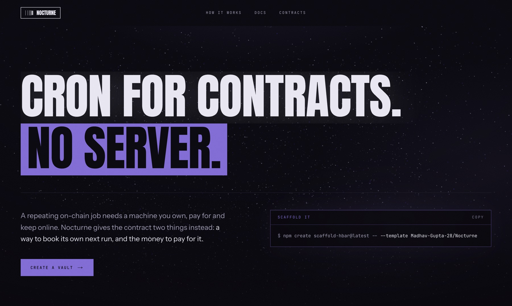
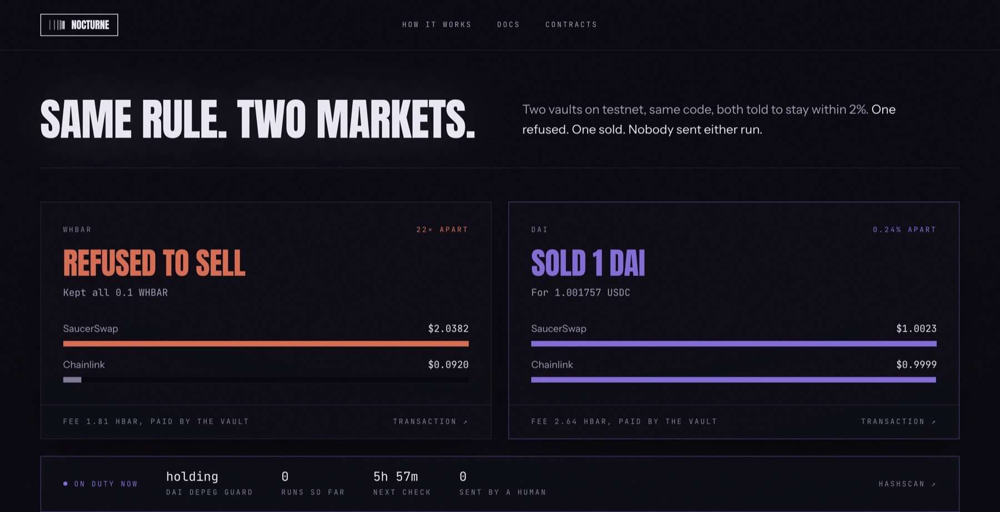
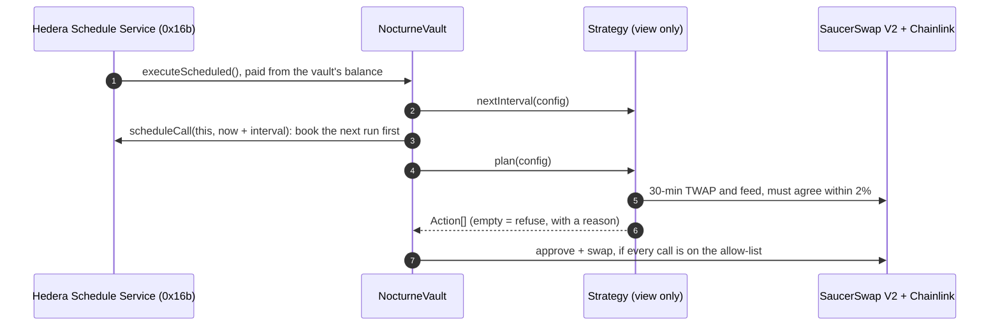
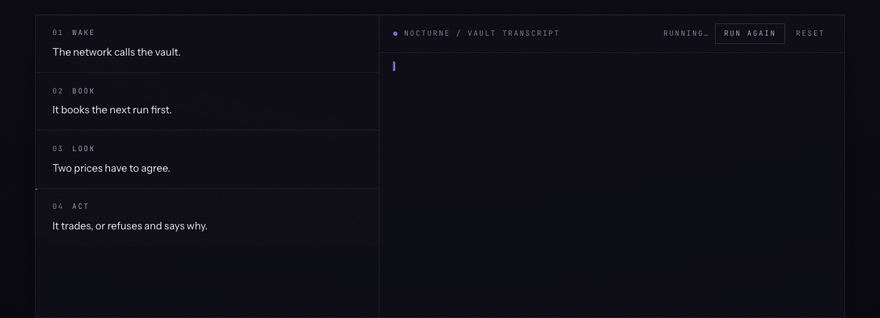
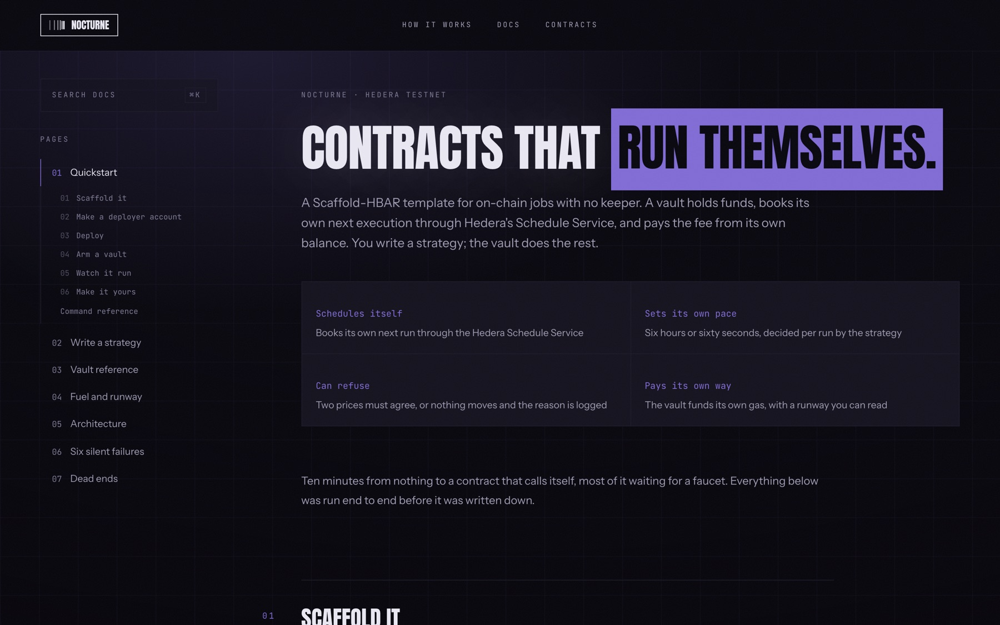

# Nocturne

**Cron for contracts. No server.**

A Scaffold-HBAR template for on-chain jobs with no keeper. A vault books its own
next run through the Hedera Schedule Service, pays for it from its own balance,
and won't trade unless SaucerSwap and Chainlink agree on the price.

**Live: [hedera-nocturne.vercel.app](https://hedera-nocturne.vercel.app)** · [Docs](https://hedera-nocturne.vercel.app/docs/quickstart) · [How it works](https://hedera-nocturne.vercel.app/how-it-works)

[](https://github.com/Madhav-Gupta-28/Nocturne/actions/workflows/lint.yaml)
&nbsp;MIT · Hedera testnet · 127 offline tests + 5 live

```bash
npm create scaffold-hbar@latest -- nocturne --template Madhav-Gupta-28/Nocturne
```



---

## Proof, on testnet

Same engine, same stock 2% tolerance. One exit vault held WHBAR against a pool
that has drifted 22x from the real price; another held DAI against a pool on
its peg; a rebalancing vault held a DAI/USDC pair. Nobody sent any of their
runs. The network did, and each vault paid.



| Vault | SaucerSwap | Chainlink | What happened | Fee, paid by the vault | Transaction |
| --- | --- | --- | --- | --- | --- |
| WHBAR [`0.0.10710164`](https://hashscan.io/testnet/contract/0.0.10710164) | $2.0382 | $0.0920 | **Refused.** 22x apart. Kept all 0.1 WHBAR. | 1.81 HBAR | [HashScan](https://hashscan.io/testnet/transaction/1790319391.014683746) |
| DAI [`0.0.10710193`](https://hashscan.io/testnet/contract/0.0.10710193) | $1.0023 | $0.9999 | **Sold.** 0.24% apart: approve + swap, 1 DAI → 1.001757 USDC. | 2.64 HBAR | [HashScan](https://hashscan.io/testnet/transaction/1790319308.034520104) |
| DAI/USDC [`0.0.10716165`](https://hashscan.io/testnet/contract/0.0.10716165) | $1.0023 | $0.9999 | **Rebalanced.** `DriftRebalanceStrategy` held 100% DAI against a 50% target: sold 0.5 DAI → 0.500878 USDC. | 2.66 HBAR | [HashScan](https://hashscan.io/testnet/transaction/1790351600.061675104) |

The DAI vault's next run found nothing left to protect and booked its next check
60 days out, rather than checking every minute until its fuel ran out.

A third vault is **still running**: a DAI depeg guard at
[`0.0.10710268`](https://hashscan.io/testnet/contract/0.0.10710268), floor $0.85,
checking every six hours and paying for each check itself.

### Check it yourself

Who paid for the sale? The mirror node says the vault, and only the vault:

```bash
curl -s "https://testnet.mirrornode.hedera.com/api/v1/transactions?timestamp=1790319308.034520104" \
  | jq '.transactions[] | {scheduled, result, paid_by: [.transfers[] | select(.amount < 0)]}'
```

```json
{ "scheduled": true, "result": "SUCCESS",
  "paid_by": [{ "account": "0.0.10710193", "amount": -263671981 }] }
```

**Read the transfer list, not the transaction id.** A scheduled transaction's id
names whoever *created* the schedule, so it looks as if someone sent the call.
The transfer list shows who actually paid.

The same refusal is visible right now, before you arm anything:
`npm run hardhat:test:live` reads the real pool and feed and asserts that the
guard refuses.

---

## Why SaucerSwap and Chainlink are load-bearing

Remove either one and the exit strategy can't run.

| | SaucerSwap V2 | Chainlink HBAR/USD |
| --- | --- | --- |
| Read | 30-minute TWAP from the pool's `observe`, via [`TwapLib`](packages/hardhat/contracts/lib/TwapLib.sol) + [`TickMath`](packages/hardhat/contracts/lib/TickMath.sol) | `latestRoundData`, with staleness and decimals checked |
| Decides | Whether the floor has broken | Whether the pool price can be believed |
| Acts | The swap itself: `exactInputSingle` on the V2 router, with a minimum output | The minimum output, when it's the lower price |

[`PriceGuard`](packages/hardhat/contracts/lib/PriceGuard.sol) sits between the
two sources and every trade:

- **It never reverts.** A bad reading becomes a refusal with a reason: `pool has
  no window yet`, `feed unavailable`, `feed stale`, `pool price is zero`,
  `sources disagree`. A strategy that reverted would lose the vault its run.
- **It overstates the gap.** Divergence is measured against the smaller price,
  so every rounding choice makes a refusal more likely.
- **It acts on the cautious price.** `actionablePrice` takes whichever source is
  worse for the trade, and `amountOutMinimum` is set from it.

Why two sources: on 11 July 2026 a single manipulated oracle price took
[$9.05M out of Bonzo Lend](https://www.coindesk.com/web3/2026/07/11/lending-protocol-bonzo-loses-77-of-value-locked-as-usd9-million-oracle-exploit-rattles-hedera),
77% of its TVL. An automated seller that trusts one feed is a liquidation bot
working for whoever moved the price.

---

## Depth over breadth

You could call five Hedera services once each and list them all. Nocturne builds
on one, the Schedule Service, and pushes it until it breaks. Everything else is
there because the engine needs it.

| Service | What it does here | How deep |
| --- | --- | --- |
| **Schedule Service** | The engine. Each run books the next from inside the contract: `scheduleCall`, `hasScheduleCapacity`, `deleteSchedule`. | [Six silent failures](docs/hedera-landmines.md), measured |
| SaucerSwap V2 | 30-minute TWAP from the pool, and the swap itself through the router. | `TickMath` written from scratch, MIT |
| Chainlink | The second opinion. No trade unless it agrees with the pool. | Staleness set per feed heartbeat |
| Token Service | The vault associates itself with HTS tokens and holds them. | Association before custody |
| Mirror Node | Where the proof lives: the transfer list shows the vault paid. | Transfer list, not tx id |

Counting services measures surface area. The question for a template is
whether the thing it's built on still works at 4am with nobody watching. That
takes knowing how it fails.

---

## How big this gets

Chainlink Automation, the keeper network other EVM chains rent,
[isn't available on Hedera](https://docs.chain.link/chainlink-automation/overview/supported-networks).
The Schedule Service makes automation native. Nocturne makes it a template:
the vault, the fuel accounting and the price guard are written, so a new job is
one file implementing four functions.

```solidity
interface INocturneStrategy {
    function plan(bytes calldata config) external view returns (Action[] memory);
    function nextInterval(bytes calldata config) external view returns (uint256);
    function validateConfig(bytes calldata config) external view returns (bool);
    function explain(bytes calldata config) external view returns (string memory, uint256, uint256);
}
```

| Job | Status |
| --- | --- |
| Stop-loss and depeg guards | **Ships today** (`ProtectiveExitStrategy`) |
| Portfolio rebalancing | **Ships today** (`DriftRebalanceStrategy`) |
| Heartbeats | **Ships today** (`HeartbeatStrategy`) |
| Dollar-cost averaging | One file away |
| Loan protection before liquidation | One file away |
| Vesting and payroll | One file away |
| LP fee compounding | One file away |
| AI agents that must act later | One file away |

---

## How it works





**It books the next run before doing any work.** Each run schedules its
successor first, then plans. A strategy that reverts costs one run, not the
whole chain.

**The strategy sets the pace.** `nextInterval()` returns six hours for a
position far from its floor and sixty seconds for one near it. Hedera's own
`ScheduledVault` example takes a fixed interval, so it can't express this.

**It pays its own way.** Fees come from the vault's balance. `runway()` tells
you how many runs are left, using the reserve the network actually demands, not
the fee it charges (see landmine 5).

| Contract | Role |
| --- | --- |
| `NocturneVault` | Holds funds, books schedules, runs plans. Never reverts inside a scheduled call. |
| `NocturneFactory` | One vault per owner. Real deploys, never clones (clones can't schedule). |
| `INocturneStrategy` | Four functions: `plan`, `nextInterval`, `validateConfig`, `explain`. |
| `HeartbeatStrategy` | Fixed cadence. The smallest strategy that works. |
| `ProtectiveExitStrategy` | Sells to a floor. One-way and urgent. |
| `DriftRebalanceStrategy` | Holds a ratio. Two-way, and skips trades that cost more than they fix. |
| `PriceLens` | Read-only view of what the guard sees, for the frontend. |

Three strategies with different shapes on one engine is the evidence that the
interface holds. A fourth is a new file, not a rewrite.

---

## Six ways HSS automation fails silently

All measured on testnet. None are in Hedera's docs. Each comes with the command
that reproduces it in [`docs/hedera-landmines.md`](docs/hedera-landmines.md).

1. **1M gas kills the chain.** A self-rescheduling call needs ~1.5M. At 1M it
   runs once, reports SUCCESS, and never runs again.
2. **The clock is ~2 seconds behind.** Scheduled calls see an early
   `block.timestamp`.
3. **One schedule per transaction.** Book two and the whole transaction fails.
4. **62 days maximum.** Anything later is refused.
5. **The payer is checked against gas reserved, not gas burned.** The first demo
   vault [died holding 2.76 HBAR](https://hashscan.io/testnet/transaction/1790184109.000053722):
   each run cost 1.63, but the network wanted 3.27 up front.
6. **Mid-run, the balance is already down the whole reserve.** A fuel check
   inside the call sees a vault that looks broke.

---

## Quick start

### Prerequisites

- Node **20.18.3** or newer (CI runs 20.18.3 and 22)
- npm
- A Hedera testnet account with about **40 HBAR** from the
  [portal faucet](https://portal.hedera.com/faucet)
- Optional, for checking claims: `curl` and `jq`

### Scaffold

```bash
npm create scaffold-hbar@latest -- nocturne --template Madhav-Gupta-28/Nocturne
cd nocturne
```

The `--` is required. Without it, `--template` is consumed by npm, and you land
in the stock template picker.

> **If GitHub rate-limits the CLI, you get the wrong project.** The CLI reads
> `template.json` through the GitHub API. When that call fails it quietly falls
> back to Foundry, and `packages/hardhat` is dropped. Pin the choices and the
> API call stops mattering:
>
> ```bash
> npm create scaffold-hbar@latest -- nocturne --template Madhav-Gupta-28/Nocturne \
>   -f nextjs-app -s hardhat --package-manager npm
> ```

### Environment variables

Every variable has a working testnet default. The only one you must create is
the deployer key, and a script writes it for you.

| Variable | File | Required | What it is |
| --- | --- | --- | --- |
| `DEPLOYER_PRIVATE_KEY_ENCRYPTED` | `packages/hardhat/.env` | to deploy | Written by `npm run hardhat:account:generate` (or `:import`). Password-encrypted. Never paste a raw key. |
| `HEDERA_RPC_URL` | `packages/hardhat/.env` | no | JSON-RPC for Hardhat. Default `https://testnet.hashio.io/api`. |
| `NEXT_PUBLIC_HEDERA_TESTNET_RPC_URL` | `packages/nextjs/.env.local` | no | Frontend RPC. Default Hashio testnet. |
| `NEXT_PUBLIC_HEDERA_MAINNET_RPC_URL` | `packages/nextjs/.env.local` | no | Frontend RPC. Default Hashio mainnet. |
| `NEXT_PUBLIC_WALLET_CONNECT_PROJECT_ID` | `packages/nextjs/.env.local` | no | Your WalletConnect id. The scaffold ships a shared one for development. |
| `HEDERA_MIRROR_TESTNET_URL` | `packages/nextjs/.env.local` | no | Mirror node for the account API route. Default public testnet. |

### Run it

```bash
npm run hardhat:test                                   # 127 tests, no network
npm run hardhat:account:generate                       # then fund it at the faucet
npm run hardhat:deploy -- --network hederaTestnet      # six contracts
npm run hardhat:verify:sourcify -- --network hederaTestnet
npm run next:dev                                       # http://localhost:3000
```

Arm a vault from the terminal instead of the UI:

```bash
cd packages/hardhat
FUEL_HBAR=12 INTERVAL=120 npx hardhat run scripts/armVault.ts --network hederaTestnet
npx hardhat run scripts/armExitVault.ts --network hederaTestnet   # the refusal above
npx hardhat run scripts/watchVault.ts --network hederaTestnet     # reads only
```

**Extend it with an agent.** The [Hedera Harness recipe](.harness/README.md)
asks a coding agent to add a DCA strategy and grades the result:
`npm run harness:validate` (no agent) or `npm run harness:run`.

**Budget against the reserve, not the fee.** A run needs 3.27 HBAR in the vault
to be accepted and is charged about 1.63, so 12 HBAR buys six runs, not seven.
The owner's wallet needs gas headroom too: the relay will not submit a
transaction unless the sender holds its whole gas limit. At 114 tinybar per gas
that is ~4.6 HBAR to create a vault (4M gas) and ~2.9 to arm it (2.5M), on top
of the fuel, and about twice that if the wallet prices gas EIP-1559 style. The
app sends the network price so the lower figure applies.



---

## Deployed on testnet

All Sourcify-verified, so HashScan shows source.

| Contract | Address |
| --- | --- |
| NocturneFactory | [`0xc0f202Ac01475AFBD07e09643d56bdacC9294B78`](https://hashscan.io/testnet/contract/0xc0f202Ac01475AFBD07e09643d56bdacC9294B78) |
| ProtectiveExitStrategy | [`0x942bBa07CfC2FAf1dD000C73FF04ccAabC61dBfd`](https://hashscan.io/testnet/contract/0x942bBa07CfC2FAf1dD000C73FF04ccAabC61dBfd) |
| DriftRebalanceStrategy | [`0xfFFc7Da411a899e8c76fc4546D63e8e38Fc55D64`](https://hashscan.io/testnet/contract/0xfFFc7Da411a899e8c76fc4546D63e8e38Fc55D64) |
| HeartbeatStrategy | [`0xA5638e6682e2FDCC89CEE92Ffc9EC98F3D602428`](https://hashscan.io/testnet/contract/0xA5638e6682e2FDCC89CEE92Ffc9EC98F3D602428) |
| PriceLens | [`0x7F017Bd04879389b2A9CEeD5941EeE75aD28cCdb`](https://hashscan.io/testnet/contract/0x7F017Bd04879389b2A9CEeD5941EeE75aD28cCdb) |
| Heartbeat | [`0x8b63C92F7d906862922D060C7Ffc294d8a43ec0b`](https://hashscan.io/testnet/contract/0x8b63C92F7d906862922D060C7Ffc294d8a43ec0b) |

---

## Rubric map

| Criterion | Where to look |
| --- | --- |
| **Ecosystem integration** | SaucerSwap V2 (TWAP + router swap) and Chainlink HBAR/USD decide every trade. [Load-bearing](#why-saucerswap-and-chainlink-are-load-bearing), [on-chain proof](#proof-on-testnet), `test/live/`. |
| **Documentation** | This README, seven docs pages served in the app at `/docs` ([`docs/`](docs)), [`ARCHITECTURE.md`](ARCHITECTURE.md), [`AGENTS.md`](AGENTS.md) for coding agents. |
| **Code quality** | 127 offline tests + 5 live, CI on Node 20 and 22, zero lint warnings, every contract Sourcify-verified, and a [Hedera Harness recipe](.harness/README.md) verified both ways. |
| **Hedera service depth** | [Depth over breadth](#depth-over-breadth): the Schedule Service is the engine, with [six measured failure modes](docs/hedera-landmines.md). Plus the Token Service and Mirror Node. |

---

## Reading order

1. [`docs/quickstart.md`](docs/quickstart.md): nothing to a running vault.
2. [`contracts/interfaces/INocturneStrategy.sol`](packages/hardhat/contracts/interfaces/INocturneStrategy.sol): four functions.
3. [`contracts/strategies/HeartbeatStrategy.sol`](packages/hardhat/contracts/strategies/HeartbeatStrategy.sol): the simplest one.
4. [`contracts/NocturneVault.sol`](packages/hardhat/contracts/NocturneVault.sol): `executeScheduled` is the heart of it.
5. [`docs/hedera-landmines.md`](docs/hedera-landmines.md), then [`ARCHITECTURE.md`](ARCHITECTURE.md) for every chain fact, measured or assumed.

---

## Built on Scaffold-HBAR

Next.js App Router, wagmi + RainbowKit, Hardhat, Hashio and Mirror Node config,
the Debug Contracts page and the block explorer, all kept. Two fixes on top,
each checked against a stock scaffold first:

- **`.npmrc` at the root.** The stock scaffold puts `legacy-peer-deps` only in
  `packages/hardhat/.npmrc`, where a root workspace install ignores it, so
  `npm install` fails on an ERESOLVE.
- **`@x402/*` aliased out in `next.config.ts`.** Otherwise `npm run next:build`
  fails on modules nothing here uses.

[Scaffold-HBAR docs](https://docs.hedera.com/solutions/tools/scaffold-hbar/index)
· [create-scaffold-hbar](https://github.com/hedera-dev/create-scaffold-hbar)
· [Faucet](https://portal.hedera.com/faucet)
· [HashScan](https://hashscan.io/testnet)

MIT
